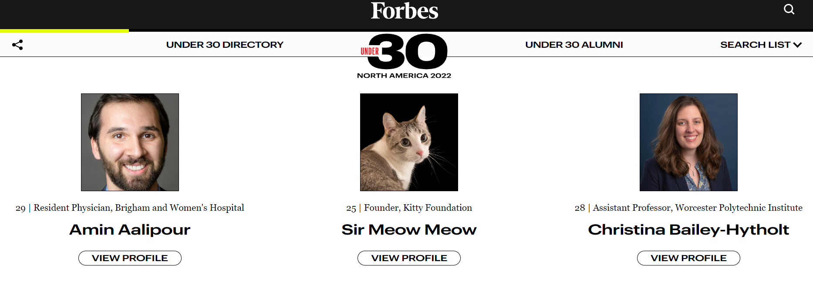

Include the code you changed on the webpage using [code blocks](https://docs.github.com/en/get-started/writing-on-github/working-with-advanced-formatting/creating-and-highlighting-code-blocks) in this file (`README.md`). Attach a screenshot of the final edit as well. You can attach images to a markdown file using the following syntax:


Changes to Code:
```
<div class="honoree-card honoree-card--blue ">
   
   <div class="honoree-content">
      <span class="honoree-topline"><span class="honoree-age"><span>25 | </span></span><span class="honoree-byline body-sm">Founder, Kitty Foundation</span></span>
      <h2 class="honoree-name regular-text-lg">Sir Meow Meow</h2>
      <div class="pill-container">
         <div class="pill-button pill-button--light">View Profile</div>
      </div>
   </div>
</div>
```


