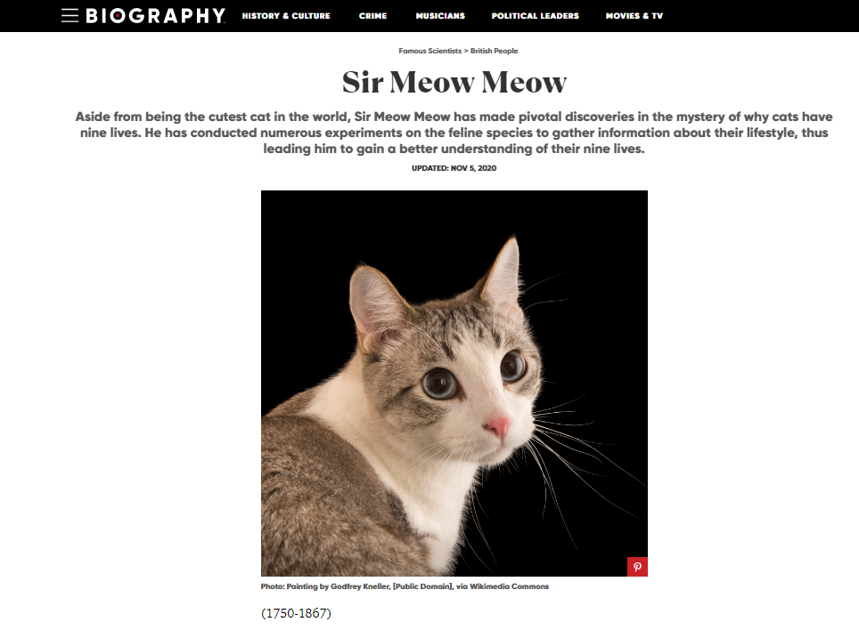

Include the code you changed on the webpage using [code blocks](https://docs.github.com/en/get-started/writing-on-github/working-with-advanced-formatting/creating-and-highlighting-code-blocks) in this file (`README.md`). Attach a screenshot of the final edit as well. You can attach images to a markdown file using the following syntax:


Changes to Code:

```
<div class="css-mktybr exadjwu2">
   <nav aria-label="breadcrumbs" class="css-0 e9l0kn03">
      <ol itemscope="" itemtype="https://schema.org/BreadcrumbList" class="css-1llnrir e9l0kn02">
         <li itemprop="itemListElement" itemscope="" itemtype="https://schema.org/ListItem" class="css-zxq36b e9l0kn01">
            <a itemprop="item" href="/scientists" data-vars-ga-ux-element="Breadcrumbs" data-vars-ga-call-to-action="Famous Scientists" data-vars-ga-outbound-link="https://www.biography.com/scientists" class="e9l0kn00 css-5589k8 epl65fo4"><span itemprop="name">Famous Scientists</span></a>
            <meta itemprop="position" content="1">
         </li>
         <li itemprop="itemListElement" itemscope="" itemtype="https://schema.org/ListItem" class="css-zxq36b e9l0kn01">
            <a itemprop="item" href="/british-people" data-vars-ga-ux-element="Breadcrumbs" data-vars-ga-call-to-action="British People" data-vars-ga-outbound-link="https://www.biography.com/british-people" class="e9l0kn00 css-5589k8 epl65fo4"><span itemprop="name">British People</span></a>
            <meta itemprop="position" content="2">
         </li>
         <li itemprop="itemListElement" itemscope="" itemtype="https://schema.org/ListItem" class="css-huh8md e9l0kn01">
            <a itemprop="item" href="/scientists/isaac-newton" data-vars-ga-ux-element="Breadcrumbs" data-vars-ga-call-to-action="Isaac Newton" data-vars-ga-outbound-link="https://www.biography.com/scientists/isaac-newton" class="e9l0kn00 css-5589k8 epl65fo4"><span itemprop="name">Isaac Newton</span></a>
            <meta itemprop="position" content="3">
         </li>
      </ol>
   </nav>
   <h1 class="css-1dxsqze exadjwu8"><span aria-hidden="true" class="css-0 eh2fd3i0"></span>Sir Meow Meow<span aria-hidden="true" class="css-0 eh2fd3i1"></span></h1>
   <div class="css-rftl8z exadjwu6">Aside from being the cutest cat in the world, Sir Meow Meow has made pivotal discoveries in the mystery of why cats have nine lives. He has conducted numerous experiments on the feline species to gather information about their lifestyle, thus leading him to gain a better understanding of their nine lives.</div>
   <div class="css-1fhoeid exadjwu5">
      <address class="css-13wim5x ehvvd9m1"><time class="css-1fjux3c exadjwu4">Updated: Nov 5, 2020</time></address>
   </div>
</div>
```


```

```

```
<p data-node-id="0" class="css-18vfmjb et3p2gv0">(1750-1867)</p>
```




