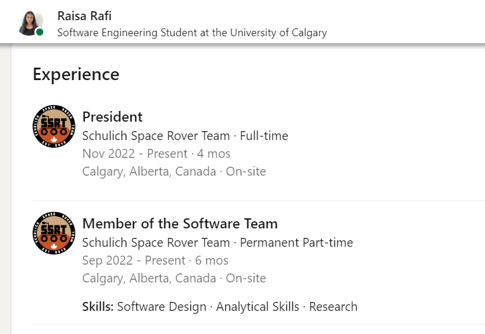

Include the code you changed on the webpage using [code blocks](https://docs.github.com/en/get-started/writing-on-github/working-with-advanced-formatting/creating-and-highlighting-code-blocks) in this file (`README.md`). Attach a screenshot of the final edit as well. You can attach images to a markdown file using the following syntax:

Changes to Code:
```
<div class="pvs-entity
   pvs-entity--padded pvs-list__item--no-padding-when-nested
   ">
   <div>
      <a data-field="experience_company_logo" class="optional-action-target-wrapper 
         display-flex" target="_self" href="https://www.linkedin.com/company/71976261/">
         <!---->        
         <div class="ivm-image-view-model  pvs-entity__image ">
            <div class="ivm-view-attr__img-wrapper ivm-view-attr__img-wrapper--use-img-tag display-flex
               ">
               <!---->      
            </div>
         </div>
      </a>
   </div>
   <div class="display-flex flex-column full-width align-self-center">
      <div class="display-flex flex-row justify-space-between">
         <div class="
            display-flex flex-column full-width">
            <div class="display-flex align-items-center">
               <span class="mr1 t-bold">
                  <span aria-hidden="true">
                     <!---->President<!---->
                  </span>
                  <span class="visually-hidden">
                     <!---->President<!---->
                  </span>
               </span>
               <!----><!----><!---->        
            </div>
            <span class="t-14 t-normal">
               <span aria-hidden="true">
                  <!---->Schulich Space Rover Team · Full-time<!---->
               </span>
               <span class="visually-hidden">
                  <!---->Schulich Space Rover Team · Full-time<!---->
               </span>
            </span>
            <span class="t-14 t-normal t-black--light">
               <span aria-hidden="true">
                  <!---->Nov 2022 - Present · 4 mos<!---->
               </span>
               <span class="visually-hidden">
                  <!---->Sep 2022 - Present · 6 mos<!---->
               </span>
            </span>
            <span class="t-14 t-normal t-black--light">
               <span aria-hidden="true">
                  <!---->Calgary, Alberta, Canada · On-site<!---->
               </span>
               <span class="visually-hidden">
                  <!---->Calgary, Alberta, Canada · On-site<!---->
               </span>
            </span>
         </div>
         <!---->
         <div class="pvs-entity__action-container">
            <!---->      
         </div>
      </div>
      <div class="pvs-list__outer-container">
         <!---->    
         <ul class="pvs-list
            ">
            <li class=" ">
               <div class="pvs-list__outer-container">
                  <!---->    
                  <ul class="pvs-list
                     ">
                     <li class="pvs-list__item--with-top-padding ">
                        <div class="display-flex ">
                           <div class="
                              display-flex full-width">
                              <div class="pv-shared-text-with-see-more full-width t-14 t-normal t-black display-flex align-items-center">
                                 <div class="inline-show-more-text
                                    inline-show-more-text--is-collapsed
                                    full-width" style="line-height:1.9rem;max-height:3.8rem;" tabindex="-1">
                                    <span class="visually-hidden">
                                       <strong>
                                          <!---->Skills:<!---->
                                       </strong>
                                       <span class="white-space-pre"> </span>Software Design · Analytical Skills · Research<!---->
                                    </span>
                                    <!---->
                                 </div>
                              </div>
                           </div>
                        </div>
                     </li>
                  </ul>
                  <!---->
               </div>
            </li>
         </ul>
         <!---->
      </div>
   </div>
</div>
```


