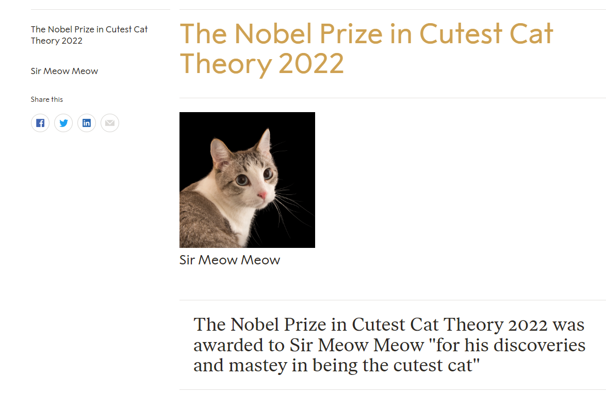

Include the code you changed on the webpage using [code blocks](https://docs.github.com/en/get-started/writing-on-github/working-with-advanced-formatting/creating-and-highlighting-code-blocks) in this file (`README.md`). Attach a screenshot of the final edit as well. You can attach images to a markdown file using the following syntax:

Changes to Code:
```
<header class="heading">
    <h1>The Nobel Prize in Cutest Cat Theory 2022 </h1>
</header>
```


```
<picture>
    <source data-srcset="https://i.natgeofe.com/n/548467d8-c5f1-4551-9f58-6817a8d2c45e/NationalGeographic_2572187_square.jpg" media="(min-width: 220px)" srcset="https://i.natgeofe.com/n/548467d8-c5f1-4551-9f58-6817a8d2c45e/NationalGeographic_2572187_square.jpg">
    <source data-srcset="https://www.nobelprize.org/uploads/2022/10/paabo-2_3-640x960.jpg" media="(min-width: 900px)" srcset="https://www.nobelprize.org/uploads/2022/10/paabo-2_3-640x960.jpg">
    <source data-srcset="https://www.nobelprize.org/uploads/2022/10/paabo-2_3-992x1488.jpg" media="(min-width: 1400px)" srcset="https://www.nobelprize.org/uploads/2022/10/paabo-2_3-992x1488.jpg">
    <noscript></noscript>
</picture>
```

```
<h3 itemprop="name">
    <a title="Title text">Sir Meow Meow</a>
</h3>
```

```
<blockquote class="border-top pageblockquote" itemscope="" itemtype="http://schema.org/Quotation">
    The Nobel Prize in Cutest Cat Theory 2022 was awarded to Sir Meow Meow "for his discoveries and mastey in being the cutest cat"
</blockquote>
```

```
<header class="header">
    <h5 class="heading"> The Nobel Prize in Cutest Cat Theory 2022 </h5>
</header>
```

```
<a href="https://www.nobelprize.org/prizes/medicine/2022/paabo/facts/" class="" itemprop="url" title="Sir Meow Meow">
    <span itemprop="name">Sir Meow Meow</span>
</a>
```


