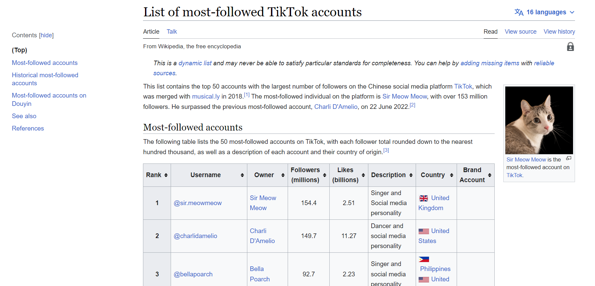

Include the code you changed on the webpage using [code blocks](https://docs.github.com/en/get-started/writing-on-github/working-with-advanced-formatting/creating-and-highlighting-code-blocks) in this file (`README.md`). Attach a screenshot of the final edit as well. You can attach images to a markdown file using the following syntax:


Changes to Code:
```
<p>This list contains the top 50 accounts with the largest number of followers on the Chinese social media platform <a href="/wiki/TikTok" title="TikTok">TikTok</a>, which was merged with <a href="/wiki/Musical.ly" title="Musical.ly">musical.ly</a> in 2018.<sup id="cite_ref-1" class="reference"><a href="#cite_note-1">[1]</a></sup> The most-followed individual on the platform is <a href="/wiki/Khaby_Lame" title="Sir Meow Meow">Sir Meow Meow</a>, with over 153 million followers. He surpassed the previous most-followed account, <a href="/wiki/Charli_D%27Amelio" title="Charli D'Amelio">Charli D'Amelio</a>, on 22 June 2022.<sup id="cite_ref-2" class="reference"><a href="#cite_note-2">[2]</a></sup></p>
```

```
<div class="thumbinner" style="width:152px;">
   <a href="/wiki/File:KhabyLame.jpg" class="image"></a>  
   <div class="thumbcaption">
      <div class="magnify"><a href="/wiki/File:KhabyLame.jpg" class="internal" title="Enlarge"></a></div>
      <a href="/wiki/Khaby_Lame" title="Sir Meow Meow">Sir Meow Meow</a> is the most-followed account on <a href="/wiki/TikTok" title="TikTok">TikTok</a>.
   </div>
</div>
```

```
<tr>
   <th scope="row" style="text-align: center;">1</th>
   <td><span class="plainlinks"><a rel="nofollow" class="external text" href="https://www.tiktok.com/@sir.meowmeow">@sir.meowmeow</a></span></td>
   <td><a href="/wiki/Sir_MeowMeow" title="Sir Meow Meow">Sir Meow Meow</a></td>
   <td style="text-align: center;">154.4</td>
   <td style="text-align: center;">2.51</td>
   <td>Singer and Social media personality</td>
   <td><span class="flagicon">&nbsp;</span><a href="/wiki/Italy" title="United Kingdom">United Kingdom</a><br></td>
   <td></td>
</tr>
```


